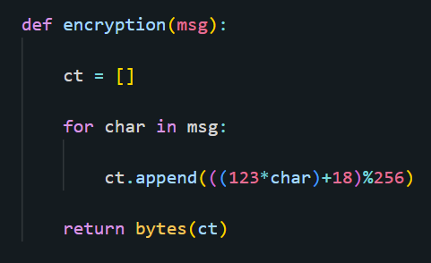
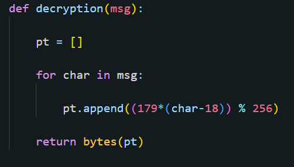
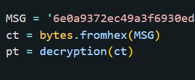

# Encryption
BabyEncyption is a very easy crypto challenge on hack the box.
First by looking at the encryption algorthim, we see that the plaintext is sent in bytes to the encryption algorthim. Then the text is broken down byte by byte, each byte is multiplied by 123,and then 18 is added to each of these multiplied bytes (under modulo 256). This is the same as xor encryption with a key of 123 followed by a shift cipher encryption with a key of 18.
`

# Decryption
To undo this encryption, first we need to undo the caesar cipher encryption then the xor encryption. First we subtract 18 to shift the bytes back. Then we find `123-1 = 179 [mod 256]` because '123*179 = 22017 = 1 [mod 256]'.

# Driver Code
Lastly we need to execute this decryption algorthim on the encrypted text to get the flag. First we transform the string of hexadecimal numbers to bytes. Then we pass it to the decryption algorthim to get the flag.` `

