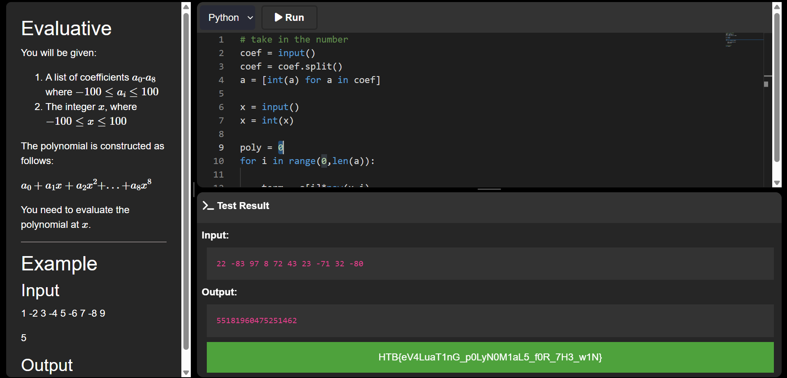

### Evaluative

A rogue bot is malfunctioning, generating cryptic sequences that control secure data vaults. Your task? Decode its logic and compute the correct output before the system locks you out!

You will be given:
1. A list of coefficients $a_0-a_8$ where $-100 \leq a_i \leq 100$
2. The integer $x$ where $-100 \leq x \leq 100$

The polynomial is constructed as follows:
$$
a_0+a_1x+a_2x^{2}+...+a_8x^{8}
$$

You need to evaluate the polynomial at $x$.

Category: Coding<br>
Difficulty: Very Easy

---

#### Flag
> HTB{eV4LuaT1nG_p0LyN0M1aL5_f0R_7H3_w1N}

Each term of the polynomial is computed as $a_ix^{i}$:

```python
# soln.py
term = a[i]*pow(x,i)
```

The polynomial is the sum of the terms $\sum_{i=0}^{8}a_ix^{i}$:

```python
# soln.py
poly = 0
for i in range(0,len(a)):

    term = a[i]*pow(x,i)
    poly+=term
```



---
