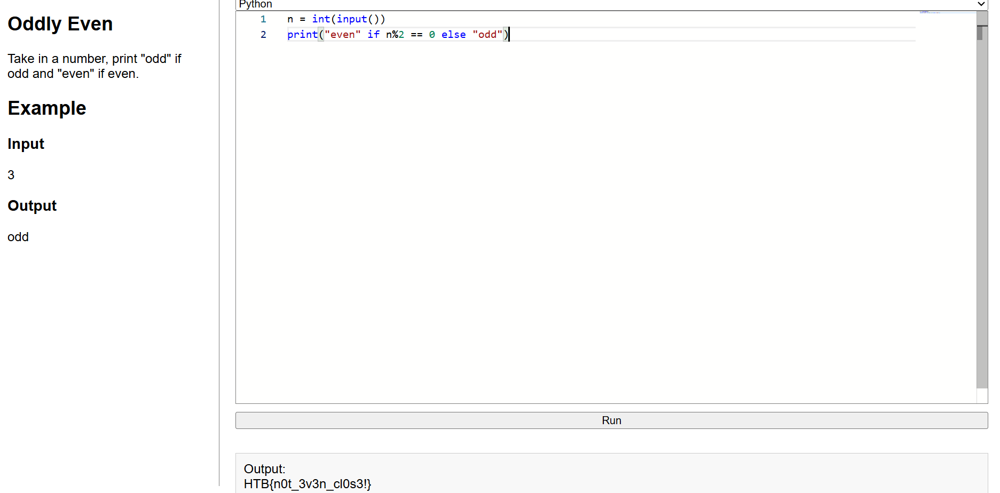

### Threat Index

The ghostly clock ticks strangely. Determine whether its chimes are even or odd to calm the restless spirits.

Take in a number, print "odd" if odd and "even" if even.

Category: Coding<br>
Difficulty: Very Easy

---

#### Flag
> HTB{thr34t_L3v3L_m1dn1ght}

If the remainder of $n$ divided by $2$ is $0$, then $n$ is even and print "even". Otherwise the remainder of $n$ divided by $2$ isn't $0$, then $n$ is odd and print "odd". 

```python
# soln.py
print("even" if n%2 == 0 else "odd")
```

