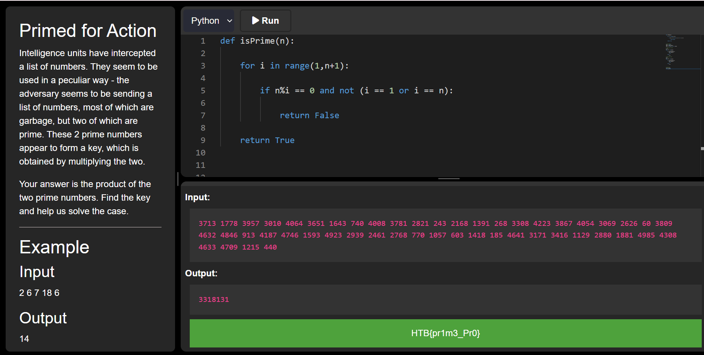

### Primed for Action

Intelligence units have intercepted a list of numbers. They seem to be used in a peculiar way: the adversary seems to be sending a list of numbers, most of which are garbage, but two of which are prime. These 2 prime numbers appear to form a key, which is obtained by multiplying the two. Your answer is the product of the two prime numbers. Find the key and help us solve the case.

Category: Coding<br>
Difficulty: Very Easy

---

#### isPrime()
A prime number is a number that is only divisible by $1$ and itself. The `isPrime(n)` function checks if $i <= n$ is divides $n$. If $i$ divides $n$ and $i \neq 1,n$, then $n$ has a factor other than $1$ and itself and is therefore not prime:

```python
# soln.py
def isPrime(n):

    for i in range(1,n+1):

        if n%i == 0 and not (i == 1 or i == n):

            return False

    return True
```

#### Finding the first prime
If `nums` is a list of numbers, iterate through the indices `i` from left to right. If `nums[i]` is prime, then we've found the first prime in the list (because all earlier elements checked were found to be not prime). If it's not prime, then the first prime must occur at a larger index so increment `i` to check the next number in the list.

```python
# soln.py
i = 0
p1 = -1
while i < len(nums):

    if isPrime(nums[i]):
        p1 = nums[i]
        break

    else:
        i+=1
```

#### Finding the second prime
If `nums` is a list of numbers, we've partially iterated through the indices `i` from left to right and found that `nums[i]` is the first prime to occur in the list. We need to find the second prime in the list. Since we've already checked all the numbers before and including `nums[i]`, we need to check the next number in the list `nums[i+1]`. If `nums[i+1]` is prime, then we've found the second prime in the list (because only one earlier elements was prime). If it's not prime, then the second prime must occur at a larger index so increment `i+1` to check the next number in the list.

```python
# soln.py
i = 0
p1 = -1
while i < len(nums):

    if isPrime(nums[i]):
        p1 = nums[i]
        break

    else:
        i+=1
```

#### Product
Once we've found both primes, the solution is the product:

```python
# soln.py
prod = p1*p2
print(prod)
```


---

#### Flag
> HTB{pr1m3_Pr0}



---
