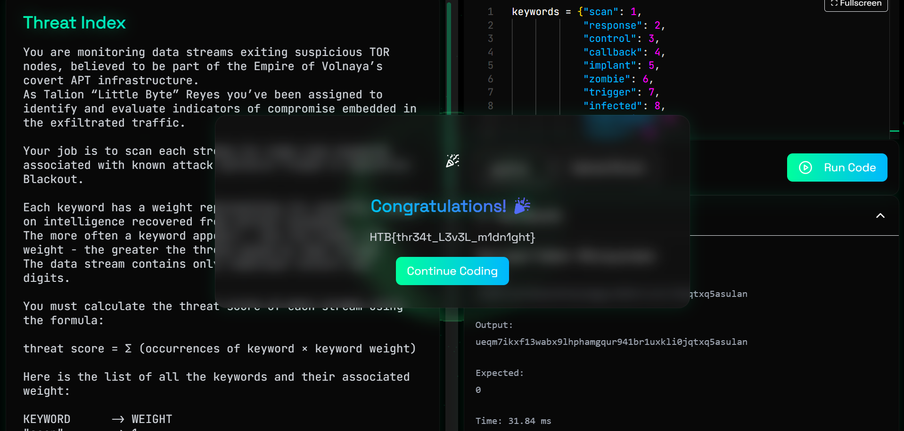

### Threat Index

Volnayan APTs are exfiltrating data through TOR nodes, embedding attack signals in plain sight. Your job is to scan each outbound stream and identify known malicious keywords linked to Operation Blackout. Each keyword has a threat level — the more hits you find, the higher the danger. Analyze the stream, tally the signals, and calculate the overall threat score.

You are monitoring data streams exiting suspicious TOR nodes, believed to be part of the Empire of Volnaya’s covert APT infrastructure.
As Talion “Little Byte” Reyes you’ve been assigned to identify and evaluate indicators of compromise embedded in the exfiltrated traffic.

Your job is to scan each stream for high-risk keywords associated with known attack patterns linked to Operation Blackout.

Each keyword has a weight representing its severity, based on intelligence recovered from earlier breaches.
The more often a keyword appears — and the higher its weight - the greater the threat posed by that stream.
The data stream contains only lowercase letters and digits.

You must calculate the threat score of each stream using the formula:

threat score = Σ (occurrences of keyword × keyword weight)

Here is the list of all the keywords and their associated weight:

KEYWORD      -> WEIGHT<br>
"scan"       -> 1<br>
"response"   -> 2<br>
"control"    -> <br>
"callback"   -> 4<br>
"implant"    -> 5<br>
"zombie"     -> 6<br>
"trigger"    -> 7<br>
"infected"   -> 8<br>
"compromise" -> 9<br>
"inject"     -> 10<br>
"execute"    -> 11<br>
"deploy"     -> 12<br>
"malware"    -> 13<br>
"exploit"    -> 14<br>
"payload"    -> 15<br>
"backdoor"   -> 16<br>
"zeroday"    -> 17<br>
"botnet"     -> 18<br>

30 <= data stream length <= 10^6

Category: Coding<br>
Difficulty: Very Easy

---

#### Flag
> HTB{thr34t_L3v3L_m1dn1ght}

We can store the keywords in a python dictionary where each key is one of the keywords and the associated value is its associated weight:

```python
# soln.py
keywords = {"scan": 1,
            "response": 2,
            "control": 3,
            "callback": 4,
            "implant": 5,
            "zombie": 6,
            "trigger": 7,
            "infected": 8,
            "compromise": 9,
            "inject": 10,
            "execute": 11,
            "deploy": 12,
            "malware": 13,
            "exploit": 14,
            "payload": 15,
            "backdoor": 16,
            "zeroday": 17,
            "botnet": 18}
```

Now we can use the built-in `.count()` method to find out how many times the `keyword` appears in the stream.

```python
# soln.py
occurrences = stream.count(keyword)
```

The total Threat Score `threat_score` is $\sum_{keyword}(\text{occurrences} × \text{weight})$. For each keyword, add each keyword's (occurrences × weight) contribution to build the total threat score:

```python
# soln.py
threat_score = 0

for keyword in keywords:

    occurrences = stream.count(keyword)
    keyword_score = occurrences*keywords[keyword]
    threat_score+=keyword_score
```



---