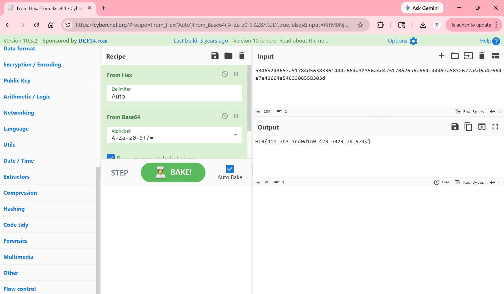

### Ancient Encodings
Your initialization sequence requires loading various programs to gain the necessary knowledge and skills for your journey. Your first task is to learn the ancient encodings used by the aliens in their communication.

Challenge Files:
<pre>
Ancient_Encodings/
└── crypto_ancient_encodings
    ├── <a href="output.txt">output.txt</a>
    └── <a href="source.py">source.py</a>
</pre>

Category: Crypto<br>
Difficulty: Very Easy

---

#### Flag
> HTB{411_7h3_3nc0d1n9_423_h323_70_574y}

Looking at `source.py`, we see that the `output.txt` file is the encoded:


```python
# source.py
def main():
    encoded_flag = encode(FLAG)
    with open("output.txt", "w") as f:
        f.write(encoded_flag)

```

The flag is base64 encoded an converted to hex:

```python
def encode(message):
    return hex(bytes_to_long(b64encode(message)))

```

We can use [CyberChef](https://cyberchef.org/) to decode the flag. First we convert the hex to base64 and the we convert the base64 to ASCII:



---