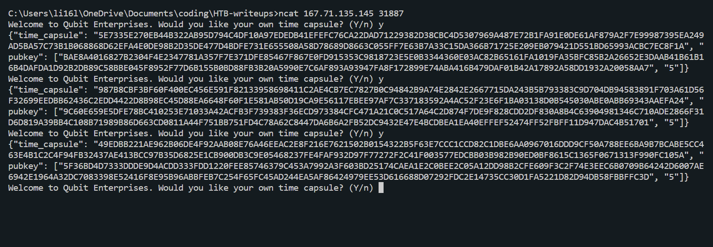

### Baby Time Capsule
Qubit Enterprises is a new company touting it's propriety method of qubit stabilization. They expect to be able to build a quantum computer that can factor a RSA-1024 number in the next 10 years. As a promotion they are giving out "time capsules" which contain a message for the future encrypted by 1024 bit RSA. They might be great engineers, but they certainly aren't cryptographers, can you find a way to read the message without having to wait for their futuristic machine?

Challenge Files: [server.py](server.py)<br><br>

Category: Crypto<br>
Difficulty: Very Easy

---

#### Encryption
First by looking at the encryption algorithm in the `server.py` file, we see that we are using the RSA encryption scheme where the encryption key $e=5$:

```Python
# server.py
class TimeCapsule():

    def __init__(self, msg):
        self.msg = msg
        self.bit_size = 1024
        self.e = 5

    def _get_new_pubkey(self):
        while True:
            p = getPrime(self.bit_size // 2)
            q = getPrime(self.bit_size // 2)
            n = p * q
            phi = (p - 1) * (q - 1)
            try:
                pow(self.e, -1, phi)
                break
            except ValueError:
                pass

        return n, self.e

    def get_new_time_capsule(self):
        n, e = self._get_new_pubkey()
        m = bytes_to_long(self.msg)
        m = pow(m, e, n)

        return {"time_capsule": f"{m:X}", "pubkey": [f"{n:X}", f"{e:X}"]}
```

---

#### Solving For m

First we need to query the server 3 times.



From our queries, we have the three equations:

```math
\begin{alignedat}{2}
& m_1 \equiv m^5 & \pmod{n_1}\\
& m_2 \equiv m^5 & \pmod{n_2}\\
& m_3 \equiv m^5 & \pmod{n_3}\\
\end{alignedat}
```

Since $n_1, n_2, n_3$ are all relatively prime, we can use the Chinese Remainder Theorem to find a solution to our equations:

```math
\begin{alignedat}{2}
& N = n_1*n_2*n_3\\
& N_1 = \frac{N}{n_1},\quad x_1 \equiv N_1^{-1} & \pmod{n_1}\\
& N_2 = \frac{N}{n_2},\quad x_2 \equiv N_2^{-1} & \pmod{n_2}\\
& N_3 = \frac{N}{n_3},\quad x_3 \equiv N_3^{-1} & \pmod{n_3}\\
\end{alignedat}
```

Lastly, we take the fifth root of the solution to get the flag:

```math
\begin{alignedat}{2}
& x \equiv m^{5} \equiv m_1*N_1*x_1+m_2*N_2*x_2+m_3*N_3*x_3 & \pmod{N}\\
& m = x^{\frac{1}{5}} & \pmod{N}\\
\end{alignedat}
```

---

#### Flag
> HTB{t3h_FuTUr3_15_bR1ghT_1_H0p3_y0uR3_W34r1nG_5h4d35!}

```python
# soln.py
M = n1*n2*n3

M1 = M//n1
M2 = M//n2
M3 = M//n3

x1 = pow(M1, -1, n1)
x2 = pow(M2, -1, n2)
x3 = pow(M3, -1, n3)

m5 = ct1*M1*x1+ct2*M2*x2+ct3*M3*x3
m5%=M

m = fifth_root(m5)
m = long_to_bytes(m)
m = m.decode()
print(m)
```

---