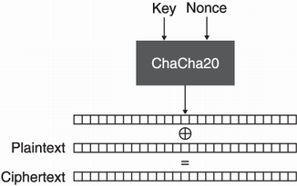

### The Last Dance
To be accepted into the upper class of the Berford Empire, you had to attend the annual Cha-Cha Ball at the High Court. Little did you know that among the many aristocrats invited, you would find a burned enemy spy. Your goal quickly became to capture him, which you succeeded in doing after putting something in his drink. Many hours passed in your agency's interrogation room, and you eventually learned important information about the enemy agency's secret communications. Can you use what you learned to decrypt the rest of the messages?

Challenge Files: [source.py](source.py), [out.txt](out.txt) <br><br>

Category: Crypto<br>
Difficulty: Very Easy

---

#### Encryption

First by looking at the encryption algorithm in the `source.py` file, we see that we are using the ChaCha20 encryption algorithm:

```Python
# source.py
def encryptMessage(message, key, nonce):
    cipher = ChaCha20.new(key=key, nonce=iv)
    ciphertext = cipher.encrypt(message)
    return ciphertext
```

We also see that that plaintext message is `Our counter agencies have intercepted your messages and a lot of your agent's identities have been exposed. In a matter of days all of them will be captured`.


Lastly, we also see that the encrypted message and the encrypted flag are encrypted using the same key and iv.

```Python
# source.py
encrypted_message = encryptMessage(message, key, iv)
encrypted_flag = encryptMessage(FLAG, key, iv)
```

---

#### Calculating the ChaCha20 Cipher Value

ChaCha20 is a stream cipher that takes in a key and an iv. The plaintext is then xored with the cipher to create the ciphertext.


Since both the encrypted flag and the encrypted message were encrypted using the same key and iv and we know the plaintext message, we can calculate the value of the ChaCha20 Cipher. We xor the plaintext message with the ciphertext message to get the value of the ChaCha20 Cipher. Then we can xor the encrypted flag with the value of the ChaCha20 Cipher to get the plaintext flag:

```math
\begin{alignedat}{2}
& msg' = ChaCha20(key,iv) \oplus msg & \to  ChaCha20(key,iv) = msg' \oplus msg\\
& flag' = ChaCha20(key,iv) \oplus flag & \to flag = ChaCha20(key,iv) \oplus flag \\
& flag =  msg' \oplus msg \oplus flag'&\\
\end{alignedat}
```

---

#### Flag
> HTB{und3r57AnD1n9_57R3aM_C1PH3R5_15_51mPl3_a5_7Ha7}

```python
# soln.py
cipher = bytes(a ^ b for a, b in zip(pt_msg, ct_msg))
pt_flag = cipher = bytes(a ^ b for a, b in zip(cipher, ct_flag))

print(cipher.decode())
```

---