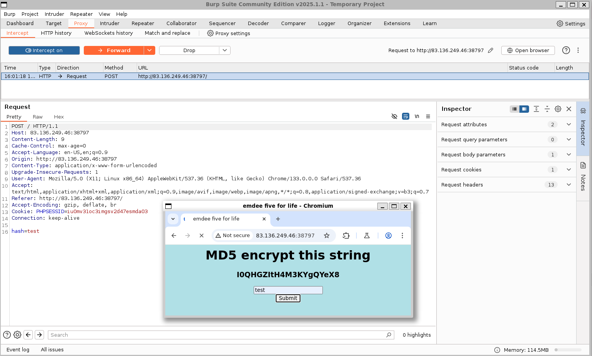

### Emdee five for life
Can you encrypt fast enough?

Category: Misc<br>
Difficulty: Easy

---

#### Website Analysis

Visiting the challenge website, we find that we need to compute the MD5 hash of a string, but the string expires quickly:

<div align="center">
  <video width="1000" controls>
    <source src="string_expires.mp4" type="video/mp4">
  </video>
</div><br>

Using BurpSuite, we submit a hash and intercept the POST Request for analysis:



We see that the hash is passed as request data, and the session ID is included as a cookie.

---

#### Solution

We can use Python to retrieve the website string, compute its hash, and submit the result. First, we initiate a session and make the initial HTTP Request with it:

```python
# soln.py
session = requests.Session()
resp = session.get(url)
resp = resp.text
```

Next, we retrieve the string to hash from the request body of the website's response and compute the MD5 Hash of the supplied string:

```python
# soln.py
md5_hash = hashlib.md5(to_hash.encode()).hexdigest()
```

Then, we send the hash in the request body, using the same session as the initial request:

```python
# soln.py
data = {'hash': md5_hash}
resp = session.post(url, data=data)
resp = resp.text
```

---

#### Flag
> HTB{N1c3_ScrIpt1nG_B0i!}

---