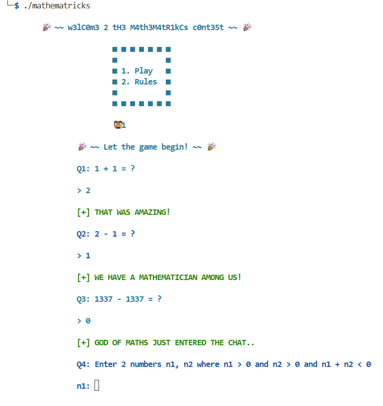
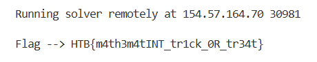

### Mathematricks
How about a magic trick? Or a math trick? Beat me and I will give you an amazing reward!

Challenge Files:
<pre>
Mathematricks/
├── challenge
│   ├── flag.txt
│   ├── glibc
│   │   ├── ld-linux-x86-64.so.2
│   │   └── libc.so.6
│   ├── <a href="./mathematricks">mathematricks</a>
│   └── <a href="./solver.py">solver.py</a>
└── README.txt
</pre>

Category: Pwn<br>
Difficulty: Very Easy

---

#### Integer Overflow

Running the [mathematricks](mathematricks) executable locally, we choose `1` to play and answer `Q1`, `Q2`, and `Q3` normally:



For `Q4`, it wants us to enter 2 positive numbers `n1, n2` whose sum is negative. Since the executable uses 32-bit signed integers, if the sum of `n1, n2` is larger than `2^31-1` it will overflow and wrap around to become negative. Each 32-bit signed integer is stored in binary with the most significant bit (MSB) being `0` for positive and `1` for negative followed by the amount, followed by 31 bits representing the magnitude in two’s complement. When the sum overflows, the MSB flips from `0` to `1`, making the CPU interpret the result as negative. Let `n1 = 2^31-1` and `n2 = 1`, then the sum is `-2^31`:

```
 n1: 01111111 11111111 11111111 11111111
 n2: 00000000 00000000 00000000 00000001
-----------------------------------------
sum: 10000000 00000000 00000000 00000000
```


the allowed range of integers is `-2^31` to `2^31`


---

#### Flag
> HTB{m4th3m4tINT_tr1ck_0R_tr34t}

Using `Solver.py` we input our solutions in decimal format:

```python
# Solver.py
sla('> ', '2')
sla('> ', '1')
sla('> ', '0')
sla('n1: ', '2147483647')
sla('n2: ', '1')
```

Now run `solver.py` with the challenge ip and port:



---