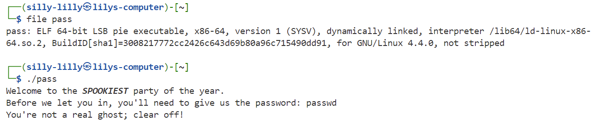
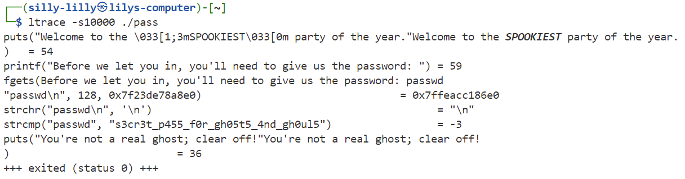
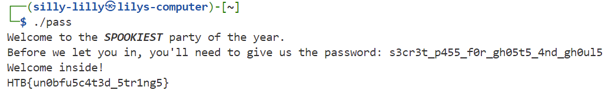

### SpookyPass
All the coolest ghosts in town are going to a Haunted Houseparty - can you prove you deserve to get in?

Challenge Files: [pass](pass)

Category: Reversing 
Difficulty: Very Easy

---

#### Obtaining the Password

The challenge file `pass` is a Linux executable which prompts the user for a password:

We run the executable and trace the library function calls, where we see it compares our supplied password to a hardcoded password:

---

#### Flag
> HTB{un0bfu5c4t3d_5tr1ng5}

---