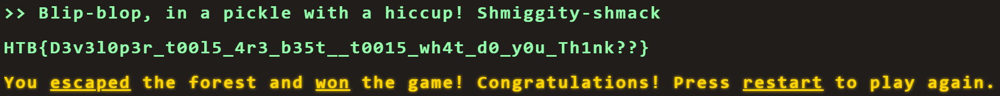

### Flag Command Challenge

Embark on the "Dimensional Escape Quest" where you wake up in a mysterious forest maze that's not quite of this world. Navigate singing squirrels, mischievous nymphs, and grumpy wizards in a whimsical labyrinth that may lead to otherworldly surprises. Will you conquer the enchanted maze or find yourself lost in a different dimension of magical challenges? The journey unfolds in this mystical escape!

Category: Web<br>
Difficulty: Very Easy

---

#### Website


The challenge website is a choose your own path game in a terminal. At each step in the game, you're given four options and each subsequent set of options is based on your previous choices:

<div align="center">
  <video width="1000" controls>
    <source src="video.mp4" alt="website" type="video/mp4">
  </video>
</div><br>

---

#### Source Code

From inspecting the source code, we see that the website is comprised of three Javascript files: `command.js`, `game.js`, and `main.js`. 

The `main.js` file contains the `CheckMessage()` function which controls the game path. It checks if your chosen command matches one of the available options provided by the game:


```Javascript
// main.js CheckMessage()
if (availableOptions[currentStep].includes(currentCommand) || availableOptions['secret'].includes(currentCommand)) {
    
    ...

} else {
    displayLineInTerminal({ text: "You do realise its not a park where you can just play around and move around pick from options how are hard it is for you????" });
    fetchingResponse = false;
}
```

The game loads all of the available options provided by the game by making an API Call to the `/api/options` endpoint in the `main.js` file:

```javascript
// main.js fetchOptions
fetch('/api/options')
    .then((data) => data.json())
    .then((res) => {
        availableOptions = res.allPossibleCommands;

    })
    .catch(() => {
        availableOptions = undefined;
    })
```

We make our own API Call to the `/api/options` endpoint to get all of the available options and see that there's a secret command:

```JSON
// api/options
{
    "allPossibleCommands": {
        
        ...

        "secret": [
            "Blip-blop, in a pickle with a hiccup! Shmiggity-shmack"
        ]
    }
}
```

---

## Flag
> HTB{D3v3l0p3r_t00l5_4r3_b35t__t0015_wh4t_d0_y0u_Th1nk??}

We give the game terminal the secret command to get the flag:



---