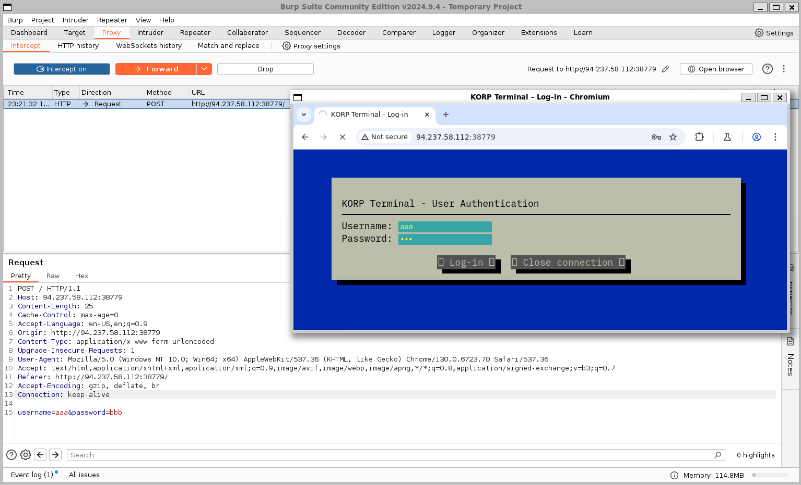
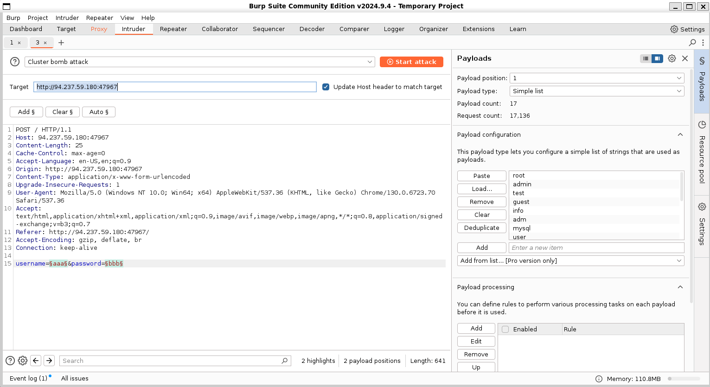
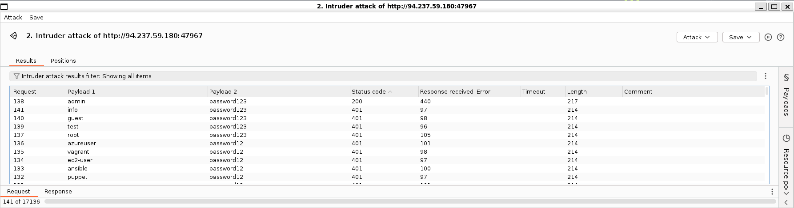
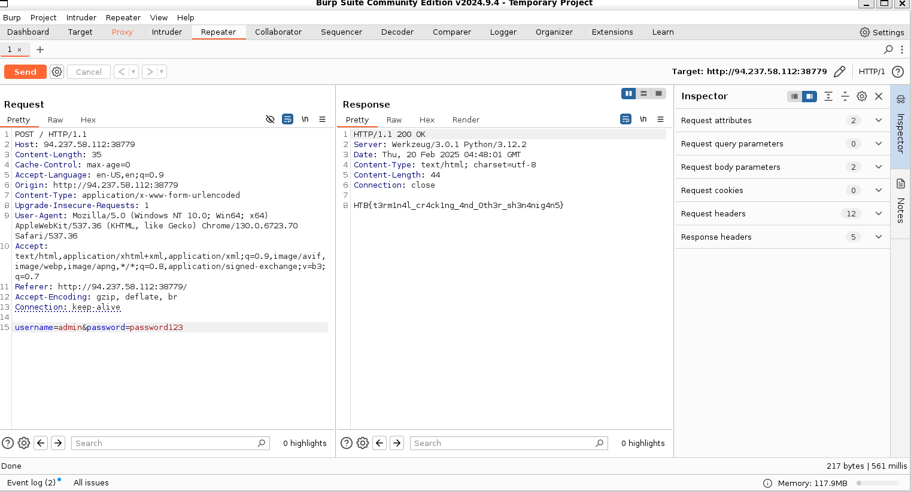

### KORP Terminal
Your faction must infiltrate the KORP™ terminal and gain access to the Legionaries' privileged information and find out more about the organizers of the Fray. The terminal login screen is protected by state-of-the-art encryption and security protocols.  
Category: Web 
Difficulty: Very Easy

---

#### POST Request

We visit the challenge website and see a login page. Using BurpSuite Proxy, we try to login to the website and intercept a POST Request:

In BurpSuite, we send the intercepted POST Request to the Intruder. Since the website sends our supplied login credentials in the request body, we can use wordlists to brute force the login. We use a Cluster Bomb Attack, which tests multiple payload sets across different positions in the request, allowing us to try different username and password combinations:

Intruder tries all the login combinations, and the incorrect ones return a 401 Error Status, while the correct one returns a 200 Success Status:

---

#### Flag
> HTB{t3rm1n4l_cr4ck1ng_4nd_0th3r_sh3n4nig4n5}

In BurpSuite, we send the intercepted POST Request to the Repeater. We then modify the request body to match the login credentials we found from the repeater to get the flag:

---