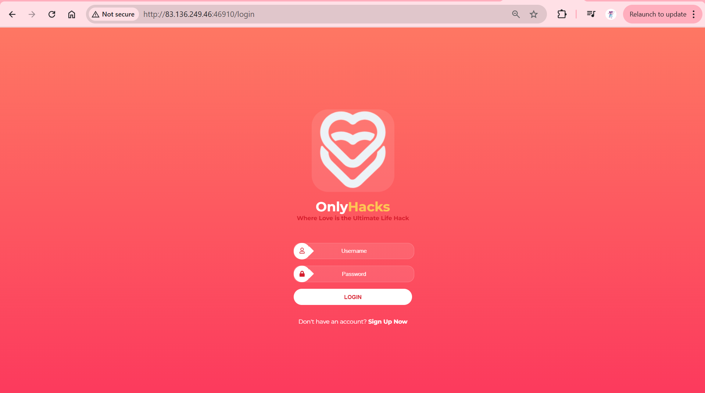
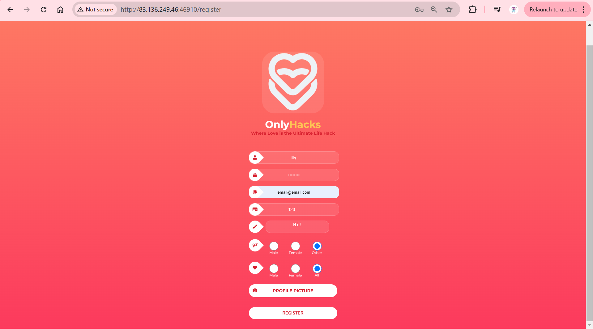
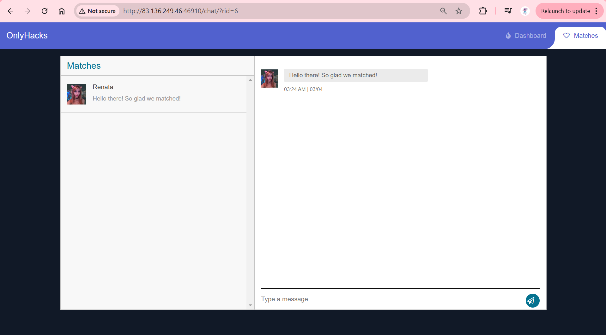
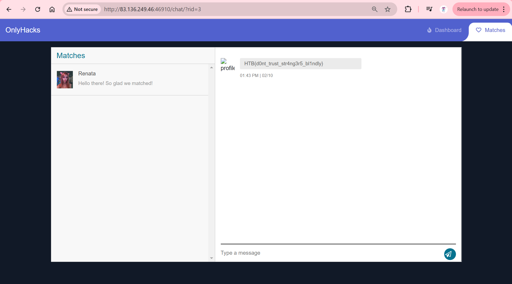

### OnlyHacks
Dating and matching can be exciting especially during Valentine's, but it’s important to stay vigilant for impostors. Can you help identify possible frauds?

Category: Web 
Difficulty: Very Easy

---

#### Insecure Direct Object Reference

We visit the challenge website and are met with a login page:

We register for an account:

Upon creating our account we get access to a chat room with Renata:

The URL contains a chat room ID parameter `rid`, which is initially set to `6`. Changing the room ID switches the current chat room. We change the rid to 3 to obtain the flag:

---

#### Flag
> HTB{d0nt_trust_str4ng3r5_bl1ndly}

---