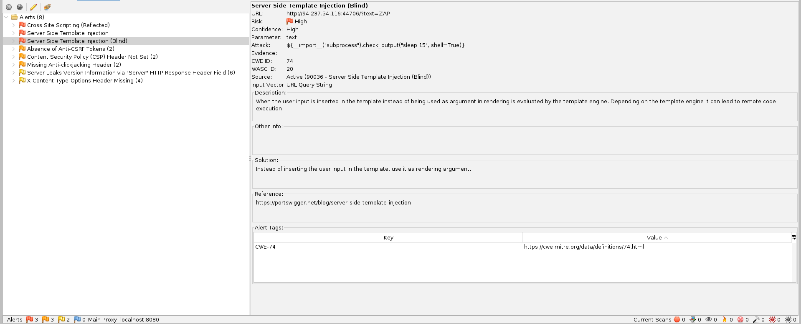
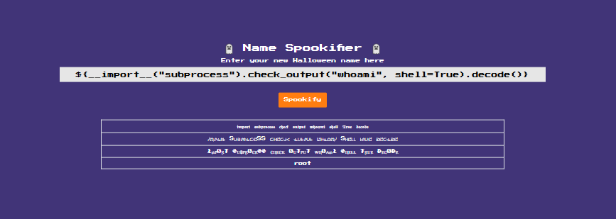
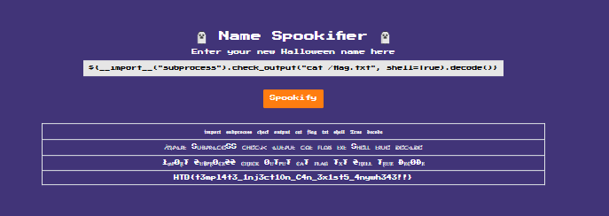

### Spookifier
There's a new trend of an application that generates a spooky name for you. Users of that application later discovered that their real names were also magically changed, causing havoc in their life. Could you help bring down this application?

Challenge Files:
<pre>
Spookifier/
└── web_spookifier
    ├── build-docker.sh
    ├── challenge
    │   ├── application
    │   │   ├── blueprints
    │   │   │   └── <a href="routes.py">routes.py</a>
    │   │   ├── <a href="main.py">main.py</a>
    │   │   ├── static
    │   │   │   ├── css
    │   │   │   │   ├── index.css
    │   │   │   │   └── nes.css
    │   │   │   └── images
    │   │   │       └── vamp.png
    │   │   ├── templates
    │   │   │   └── <a href="index.html">index.html</a>
    │   │   └── <a href="util.py">util.py</a>
    │   └── run.py
    ├── config
    │   └── supervisord.conf
    ├── <a href="Dockerfile">Dockerfile</a>
    └── flag.txt

10 directories, 12 files
</pre>

Category: Web<br>
Difficulty: Very Easy

---

#### Server Side Template Injection (SSTI)

We use OWASP ZAP to scan the challenge website. OWASP ZAP detects a blind Server-Side Template Injection (SSTI) Vulnerability:



We can exploit this vulnerability to execute linux shell commands:



---

#### Flag
> HTB{t3mpl4t3_1nj3ct10n_C4n_3x1st5_4nywh343!!}

Based on the `Dockerfile` from the challenge files, we know that the flag is located in the root directory:

```Dockerfile
COPY flag.txt /flag.txt
```

We view the contents of the flag:




---