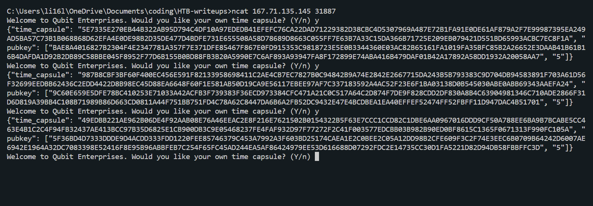

# Baby Time Capsule

Baby Time Capsule is a very easy crypto challenge on hack the box that focuses on RSA.

## Encryption
First by looking at the encryption algorithm, we see that we are using the RSA encryption algorithm with `p` and `q` being randoms and `n = p*q`.

````Python
def __init__(self, msg):
    self.msg = msg
    self.bit_size = 1024
    self.e = 5

def _get_new_pubkey(self):
    while True:
        p = getPrime(self.bit_size // 2)
        q = getPrime(self.bit_size // 2)
        n = p * q
        phi = (p - 1) * (q - 1)
        try:
            pow(self.e, -1, phi)
            break
        except ValueError:
            pass

    return n, self.e
````

We also see that `e=5`. Lastly, we see that `m = pow(m,e,n)` and the encrypted message `m` and public key `[n,e]` are returned.

````Python

def get_new_time_capsule(self):
    n, e = self._get_new_pubkey()
    m = bytes_to_long(self.msg)
    m = pow(m, e, n)

    return {"time_capsule": f"{m:X}", "pubkey": [f"{n:X}", f"{e:X}"]}
````

# Query

First we need to query the server using netcat 3 times.


# Solving for m

From our query, we know that `m1 = 5E7335E270EB44B322AB95D794C4DF10A97EDEDB41EFEFC76CA22DAD71229382D38CBC4D5307969A487E72B1FA91E0DE61AF879A2F7E99987395EA249AD5BA57C73B1B068868D62EFA4E0DE98B2D35DE477D4BDFE731E655508A58D78689D8663C055FF7E63B7A33C15DA366B71725E209EB079421D551BD65993ACBC7EC8F1A`, `n1 = BAE8A4016827B2304F4E2347781A357F7E371DFE85467F867E0FD915353C9818723E5E0B3344360E03AC82B65161FA1019FA35BFC85B2A26652E3DAAB41B61B16B4DAFDA1D92B2DB89C58BBE045F8952F77D6B155B0BD88FB3B20A5990E7C6AF893A93947FA8F172899E74ABA416B479DAF01B42A17892A58DD1932A20058AA7`, `e1 = 5`, `m2 = 987B8CBF3BF60F400EC456E591F82133958698411C2AE4CB7EC7827B0C94842B9A74E2842E2667715DA243B5B793383C9D704DB94583891F703A61D56F32699EEDBB62436C2EDD4422D8B98EC45D88EA6648F60F1E581AB50D19CA9E56117EBEE97AF7C337183592A4AC52F23E6F1BA03138D0B545030ABE0ABB69343AAEFA24`, `n2 = 9C60E659E5DFE78BC410253E71033A42ACFB3F739383F36ECD973384CFC471A21C0C517A64C2D874F7DE9F828CDD2DF830A8B4C63904981346C710ADE2866F31D6D819A39BB4C108B71989B86D663CD0811A44F751BB751FD4C78A62C8447DA6B6A2FB52DC9432E47E4BCDBEA1EA40EFFEF52474FF52FBFF11D947DAC4B51701`, `e2 = 5`, `m3 = 49EDBB221AE962B06DE4F92AAB08E76A46EEAC2E8F216E7621502B0154322B5F63E7CCC1CCD82C1DBE6AA0967016DDD9CF50A788EE6BA9B7BCABE5CC463E4B1C2C4F94FB32437AE413BCC97B35D6825E1CB900DB3C9E05468237FE4FAF932D97F77272F2C41F003577EDCBB03B982B90ED0BF8615C1365F0671313F990FC105A`, `n3 = 5F36BD4D7333DDDE9D4ACDD333FDD1220FEE85746379C453A7992A3F603BD25174CAEA1E2C0BEE2C05A12DD98B2CFE609F3C2F74E3EEC6B0709B64242D6007AE6942E1964A32DC7083398E52416F8E95B96ABBFEB7C254F65FC45AD244EA5AF86424979EE53D616688D07292FDC2E14735CC30D1FA5221D82D94DB58FBBFFC3D`, and `e3 = 5`.

Now we know `m1 = m^5 % n1`, `m2 = m^5 % n2`, and `m3 = m^5 % n3` from looking at the encryption algorithm. This looks like the Chinese Remainder Theorem.

Therefore we must calculate `M = n1*n2*n3` to get solution `x = m^5 % M`.

````Python
N = n1*n2*n3
````

Next we must calculate `M1 = M/n1`, `M2 = M/n2`, and `M3 = M/n3`.

````Python
N1 = N//n1
N2 = N//n2
N3 = N//n3
````

After this we must calculate the inverses: `x1 = N1^(-1) % n1`, `x2 = N2^(-1) % n2`, and `x3 = N3^(-1) % n3`.

````Python
x1 = pow(N1, -1, n1)
x2 = pow(N2, -1, n2)
x3 = pow(N3, -1, n3)
````

Putting it all together, we have `x = m^5 = (m1*N1*x1+m2*N2*x2+m3*N3*x3) % N`. Lastly `m = x^(1/5) = (m^5)^(1/5)`.

````Python
m5 = ct1*N1*x1+ct2*N2*x2+ct3*N3*x3
m5%=N

m = fifth_root(m5)
````

## Flag
> HTB{t3h_FuTUr3_15_bR1ghT_1_H0p3_y0uR3_W34r1nG_5h4d35!}