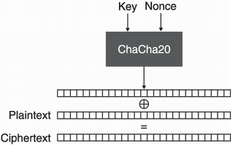

# Encryption

The Last Dnace is a very easy crypto challenge on hack the box.
First by looking at the encryption algorthim, we see that we are using the ChaCha20 encryption algorithm.

````Python
def encryptMessage(message, key, nonce):
    cipher = ChaCha20.new(key=key, nonce=iv)
    ciphertext = cipher.encrypt(message)
    return ciphertext
````

We also see that the `key` and `iv` used are random and that plaintext `message` is `Our counter agencies have intercepted your messages and a lot of your agent's identities have been exposed. In a matter of days all of them will be captured`.

````Python
message = b"Our counter agencies have intercepted your messages and a lot "
message += b"of your agent's identities have been exposed. In a matter of "
message += b"days all of them will be captured"

key, iv = os.urandom(32), os.urandom(12)
````

Lastly, we also see that the encrypted message and the encrypted flag are encrypted using the same key and iv.

````Python
encrypted_message = encryptMessage(message, key, iv)
encrypted_flag = encryptMessage(FLAG, key, iv)
````

# ChaCha20

ChaCha20 is a stream cipher that takes in a key and an iv. The plaintext is then xored with the cipher to create the ciphertext.


# Decyrption

Since both the encrypted flag and the encrypted message were encrypted using ChaCha20 with the same key and iv and we know the plaintext message, we can calculate the value of the ChaCha20 cipher.

First we note that in the source code data is written to the out.txt file. The first line of the out.txt file is the iv, the seccond line is the encrypted message, and the third and final line is the encrypted ciphertext.

````Python
data = iv.hex() + "\n" + encrypted_message.hex() + "\n" + encrypted_flag.hex()
    writeData(data)
````

Now for our code, we need to split up the lines in out.txt and transform the strings into bytes so that we can xor them. We also need to copy the plaintext message `pt_msg` from the source code.

````Python
iv = bytes.fromhex('c4a66edfe80227b4fa24d431')
ct_msg = bytes.fromhex('7aa34395a258f5893e3db1822139b8c1f04cfab9d757b9b9cca57e1df33d093f07c7f06e06bb6293676f9060a838ea138b6bc9f20b08afeb73120506e2ce7b9b9dcd9e4a421584cfaba2481132dfbdf4216e98e3facec9ba199ca3a97641e9ca9782868d0222a1d7c0d3119b867edaf2e72e2a6f7d344df39a14edc39cb6f960944ddac2aaef324827c36cba67dcb76b22119b43881a3f1262752990')
ct_flag = bytes.fromhex('7d8273ceb459e4d4386df4e32e1aecc1aa7aaafda50cb982f6c62623cf6b29693d86b15457aa76ac7e2eef6cf814ae3a8d39c7')

pt_msg = b"Our counter agencies have intercepted your messages and a lot "
pt_msg += b"of your agent's identities have been exposed. In a matter of "
pt_msg += b"days all of them will be captured"
````

Next we must xor the plaintext message `pt_msg` with the ciphertext message `ct_msg` to get the cipher `cipher`.

````Python
cipher = bytes(a ^ b for a, b in zip(pt_msg, ct_msg))
````

Lastly, we need to xor the ciphertext flag `ct_flag` with the cipher `cipher` since the same cipher with the same key and iv to encrypt the flag and message.

````Python
pt_flag = cipher = bytes(a ^ b for a, b in zip(cipher, ct_flag))
````
