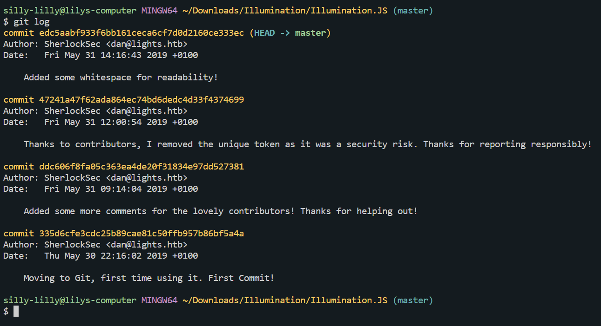
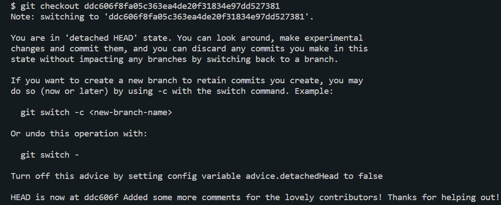
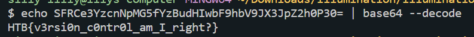

### Illumination

A Junior Developer just switched to a new source control platform. Can you find the secret token?

Challenge Files: 
<pre>
Illumination.JS/
├── <a href="bot.js">bot.js</a>
├── config.json
└── .git/
    ├── COMMIT_EDITMSG
    ├── config
    ├── description
    ├── HEAD
    ├── hooks/
    │   ├── applypatch-msg.sample
    │   ├── commit-msg.sample
    │   ├── fsmonitor-watchman.sample
    │   ├── post-update.sample
    │   ├── pre-applypatch.sample
    │   ├── pre-commit.sample
    │   ├── prepare-commit-msg.sample
    │   ├── pre-push.sample
    │   ├── pre-rebase.sample
    │   ├── pre-receive.sample
    │   └── update.sample
    ├── index
    ├── info/
    │   └── exclude
    ├── logs/
    │   ├── <a href="HEAD">HEAD</a>
    │   └── refs/
    │       └── heads/
    │           └── <a href="master">master</a>
    ├── objects/
    │   ├── 11/
    │   │   └── ce945904a5061f42d1d81276106b51dcec4b39
    │   ├── 13/
    │   │   └── 3226d84d7bcc83cf9bd680dd60d8a52641df64
    │   ├── 1c/
    │   │   └── cf7afbde496b9f53ffe7f22134b490e66008f7
    │   ├── 2a/
    │   │   └── ff779ea868217debc04da97530f3089f46e9d9
    │   ├── 30/
    │   │   └── 51d4746a51f549ea82c72c6a23db3fbbd33c6a
    │   ├── 31/
    │   │   └── 6dc217bceb0ca5bfdfa814c18e60ac833620b6
    │   ├── 33/
    │   │   ├── 59900ad3025d26017d220304a6f3e4cc9b7773
    │   │   └── 5d6cfe3cdc25b89cae81c50ffb957b86bf5a4a
    │   ├── 44/
    │   │   └── 1981f5e5eb82cccde5657c3ef77d643eb42da1
    │   ├── 47/
    │   │   └── 241a47f62ada864ec74bd6dedc4d33f4374699
    │   ├── 48/
    │   │   └── 17be4151d69dfaf8e50d39f11396dd15c94dad
    │   ├── 67/
    │   │   └── 35aa6a198fb5b9333e8df2ac0da44a05c025e8
    │   ├── 77/
    │   │   └── 5c6d15faecfc7b2edf9d31e08042920ebfc910
    │   ├── 7e/
    │   │   └── b834acc2350f020aa94cbd2f3f54767605fbfb
    │   ├── 8f/
    │   │   └── cfb2c7335186c59bb10b506a532273f9abbca1
    │   ├── 95/
    │   │   └── 794402d2527eb97c7344413d5dde0756063799
    │   ├── a6/
    │   │   └── 142717ed04f5dbc430b2c747be9e686d8316a6
    │   ├── b6/
    │   │   └── 7f71e1508934b4c5dac0c905be06f1f0cae155
    │   ├── c9/
    │   │   └── e94d1a85dc5db6fe95bf94b1953ffb328e6780
    │   ├── cd/
    │   │   └── 3ddd4ffa1faa9f25be88ed90220657b4cf8a45
    │   ├── dd/
    │   │   └── c606f8fa05c363ea4de20f31834e97dd527381
    │   ├── e5/
    │   │   └── 82ba9ac7bb4de0914224655fbb3b42435eac7c
    │   ├── e7/
    │   │   └── 2a90b435d9fc8bc8a09cf16e9ce9958c4b81a1
    │   ├── ed/
    │   │   └── c5aabf933f6bb161ceca6cf7d0d2160ce333ec
    │   ├── f0/
    │   │   └── 4294ba7c85d956949248fb472728ba9d33f3cc
    │   ├── f6/
    │   │   └── 49860ed0b24522edb58e9326a1bb6ab7479797
    │   ├── info/
    │   └── pack/
    ├── ORIG_HEAD
    └── refs/
        ├── heads/
        │   └── master
        └── tags/

38 directories, 49 files
</pre><br>


Category: Forensics<br>
Difficulty: Easy

---

#### Bot Token

The `Illumnation.JS` directory appears to contain code for a Discord Bot. Looking at the configuration file, we can see the bot needs a token to run, but it's left blank for security reasons:

```json
// config.json
{
	"token": "Replace me with token when in use! Security Risk!",
	"prefix": "~",
	"lightNum": "1337",
	"username": "UmVkIEhlcnJpbmcsIHJlYWQgdGhlIEpTIGNhcmVmdWxseQ==",
	"host": "127.0.0.1"
}
```

---

#### Git Source Control
The `Illumination.JS` directory has a `.git` subdirectory, which is used by Git for version control to track changes and manage the repository's history.

We can use Git Bash to execute Git commands. We run `git log` to see the past commits:



Looking at the past commits, we see that the developer removed the token from a prior version of the code. Using Git, we can restore the old version that contains the token:




Once we have restored the old version, we see that the Bot Token was hardcoded into the configuration file:

```json
// config.json
{
	"token": "SFRCe3YzcnNpMG5fYzBudHIwbF9hbV9JX3JpZ2h0P30=",
	"prefix": "~",
	"lightNum": "1337",
	"username": "UmVkIEhlcnJpbmcsIHJlYWQgdGhlIEpTIGNhcmVmdWxseQ==",
	"host": "127.0.0.1"
}
```

---

#### Decoding the Token

Looking at the source code for the Discord Bot, we see that the token is encoded in Base64:

```Javascript
// bot.js
client.login(Buffer.from(config.token, 'base64').toString('ascii')) //Login with secret token
```

We decode the token from Base64 to Ascii to get the flag:



---

#### Flag

> HTB{v3rsi0n_c0ntr0l_am_I_right?}

---