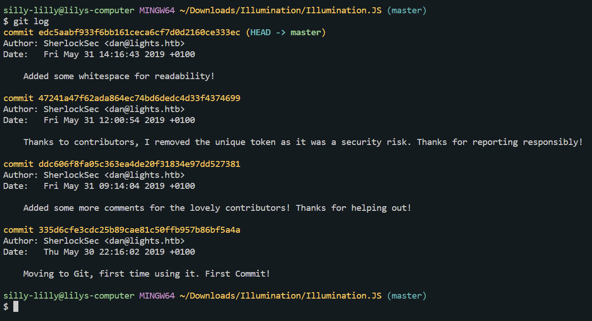

# Illumination

Illumination is an easy forensics challenge on hack the box focusing on git. The challenge description mentions that the developer switched to a new source control platform.

## Challenge Files

We are given a folder Illumination.JS which appears to contain code for a discord bot `bot.js` and a configuration file `config.json`. There is also a .git folder.

## config.json

Looking at `config.json`, we see that the bot needs a token to run, but it's left blank due to a security risk.

```Json
{
	"token": "Replace me with token when in use! Security Risk!",
	"prefix": "~",
	"lightNum": "1337",
	"username": "UmVkIEhlcnJpbmcsIHJlYWQgdGhlIEpTIGNhcmVmdWxseQ==",
	"host": "127.0.0.1"
}
```

## Git log

We know that the flag has something to do wtih source control and we see that there is a .git folder. We run `git log` to see past commits.


Looking at the past commits we see that the developer removed the token from a prior version of this code.

## Restore version

We know we want an older version of this code, we know that the commit before the developer took out the token had the ID `ddc606f8fa05c363ea4de20f31834e97dd527381` so we restore to that version using `git checkout ddc606f8fa05c363ea4de20f31834e97dd527381`.


## config.json

Looking at config.json, we see that the bot token is there.

```Json
{
	"token": "SFRCe3YzcnNpMG5fYzBudHIwbF9hbV9JX3JpZ2h0P30=",
	"prefix": "~",
	"lightNum": "1337",
	"username": "UmVkIEhlcnJpbmcsIHJlYWQgdGhlIEpTIGNhcmVmdWxseQ==",
	"host": "127.0.0.1"
}
```

The token is `SFRCe3YzcnNpMG5fYzBudHIwbF9hbV9JX3JpZ2h0P30=` which is either not the flag or encoded in some way.

## bot.js

We look to the discord bot code to look for a clue about if and how the token might be encoded. We see that the token is encoded in base64.

```Javascript
client.login(Buffer.from(config.token, 'base64').toString('ascii')) //Login with secret token
```

## Flag
> HTB{v3rsi0n_c0ntr0l_am_I_right?}

We decode the token from base64 to plaintext ascii using git bash to get hte flag

