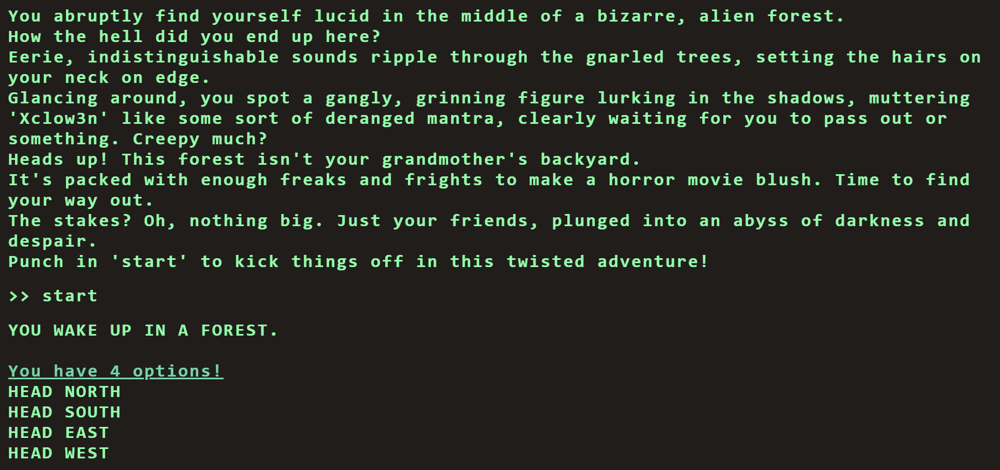
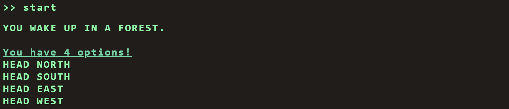
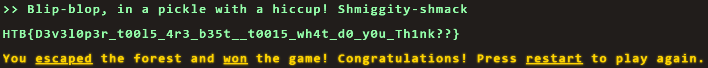

# Flag Command Challenge
Flag Command Challenge is a very easy web challenge on Hack The Box where you need to exploit an API vulnerability.

The challenge website appears to be a choose your own path game in a terminal.


At each step in the game, you're given four options. Each set of options changes based on the user's previous choices:


## main.js file
From inspecting the webpage, we see that the webpage is comprised of there java script files: `command.js`, `game.js`, `main.js`. The `command.js` file stores game variables and the `game.js` file seems to be the driver. The `main.js` file chooses a response based on the user's inputted choices.

### main.js CheckMessage() Function
From inspecting the `main.js` file, we see that the `CheckMessage()` function chooses a response based on the user's inputted choices. 

```JavaScript
async function CheckMessage() {
    fetchingResponse = true;
    currentCommand = commandHistory[commandHistory.length - 1];

    if (availableOptions[currentStep].includes(currentCommand) || availableOptions['secret'].includes(currentCommand)) {
        await fetch('/api/monitor', {
            method: 'POST',
            headers: {
                'Content-Type': 'application/json'
            },
            body: JSON.stringify({ 'command': currentCommand })
        })
            .then((res) => res.json())
            .then(async (data) => {
                console.log(data)
                await displayLineInTerminal({ text: data.message });

                if(data.message.includes('Game over')) {
                    playerLost();
                    fetchingResponse = false;
                    return;
                }

                if(data.message.includes('HTB{')) {
                    playerWon();
                    fetchingResponse = false;

                    return;
                }

                if (currentCommand == 'HEAD NORTH') {
                    currentStep = '2';
                }
                else if (currentCommand == 'FOLLOW A MYSTERIOUS PATH') {
                    currentStep = '3'
                }
                else if (currentCommand == 'SET UP CAMP') {
                    currentStep = '4'
                }

                let lineBreak = document.createElement("br");


                beforeDiv.parentNode.insertBefore(lineBreak, beforeDiv);
                displayLineInTerminal({ text: '<span class="command">You have 4 options!</span>' })
                displayLinesInTerminal({ lines: availableOptions[currentStep] })
                fetchingResponse = false;
            });


    }
    else {
        displayLineInTerminal({ text: "You do realise its not a park where you can just play around and move around pick from options how are hard it is for you????" });
        fetchingResponse = false;
    }
}
```

Since the each of the available options provided by the game are determined by the user's previous choices, `availableOptions` is a dictionary where each key represents the current step/state of the game The outermost if statement checks if the user's inputted command `currentCommand` matches one of the available options provided by the game or a secret command:

```JavaScript
if (availableOptions[currentStep].includes(currentCommand) || availableOptions['secret'].includes(currentCommand))
```

### main.js fetchOptions() Function
The game loads all of the possible states and available options provided by the game in the `availableOptions()` function using an api call to `/api/options`.

## API Call
We get all possible states and available options by making an api call to `http://94.237.63.199:36663/api/options`:

```JSON
{
    "allPossibleCommands": {
        "1": [
            "HEAD NORTH",
            "HEAD WEST",
            "HEAD EAST",
            "HEAD SOUTH"
        ],
        "2": [
            "GO DEEPER INTO THE FOREST",
            "FOLLOW A MYSTERIOUS PATH",
            "CLIMB A TREE",
            "TURN BACK"
        ],
        "3": [
            "EXPLORE A CAVE",
            "CROSS A RICKETY BRIDGE",
            "FOLLOW A GLOWING BUTTERFLY",
            "SET UP CAMP"
        ],
        "4": [
            "ENTER A MAGICAL PORTAL",
            "SWIM ACROSS A MYSTERIOUS LAKE",
            "FOLLOW A SINGING SQUIRREL",
            "BUILD A RAFT AND SAIL DOWNSTREAM"
        ],
        "secret": [
            "Blip-blop, in a pickle with a hiccup! Shmiggity-shmack"
        ]
    }
}
```

We see that the secret command/option is `Blip-blop, in a pickle with a hiccup! Shmiggity-shmack`


## Flag
> HTB{D3v3l0p3r_t00l5_4r3_b35t__t0015_wh4t_d0_y0u_Th1nk??}

We input the secret command to get the flag.


